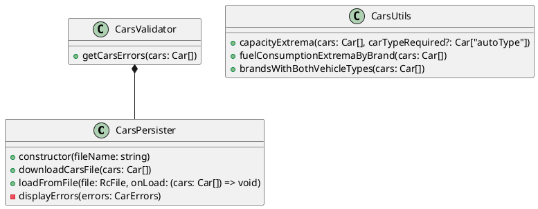

## Class Diagram

```plantuml
@startuml
class CarsPersister {
  + constructor(fileName: string)
  + downloadCarsFile(cars: Car[])
  + loadFromFile(file: RcFile, onLoad: (cars: Car[]) => void)
  - displayErrors(errors: CarErrors)
}

class CarsValidator {
  + getCarsErrors(cars: Car[])
}

class CarsUtils {
  + capacityExtrema(cars: Car[], carTypeRequired?: Car["autoType"])
  + fuelConsumptionExtremaByBrand(cars: Car[])
  + brandsWithBothVehicleTypes(cars: Car[])
}

CarsValidator *-- CarsPersister
@enduml
```
