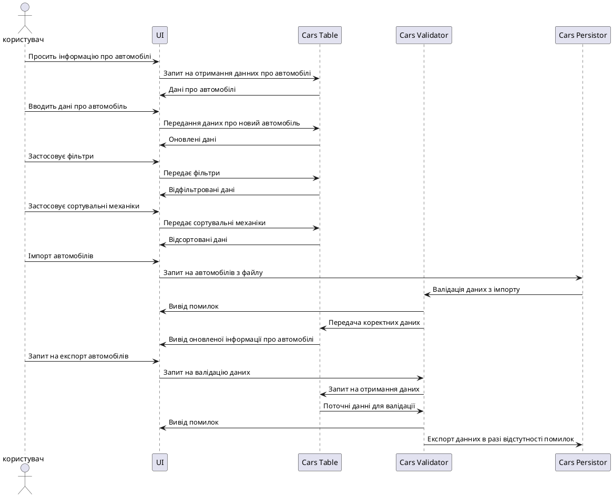

## Sequence Diagram

```plantuml
@startuml
actor       користувач   as A
participant UI
participant "Cars Table" as T
participant "Cars Validator" as V
participant "Cars Persistor" as S

A -> UI : Просить інформацію про автомобілі
UI -> T : Запит на отримання данних про автомобілі
T -> UI : Дані про автомобілі

A -> UI : Вводить дані про автомобіль
UI -> T : Передання даних про новий автомобіль
T -> UI : Оновлені дані

A -> UI : Застосовує фільтри
UI -> T : Передає фільтри
T -> UI : Відфільтровані дані

A -> UI : Застосовує сортувальні механіки
UI -> T : Передає сортувальні механіки
T -> UI : Відсортовані дані

A -> UI : Імпорт автомобілів
UI -> S : Запит на автомобілів з файлу
S -> V : Валідація даних з імпорту
V -> UI : Вивід помилок
V -> T : Передача коректних даних
T -> UI : Вивід оновленої інформації про автомобілі

A -> UI : Запит на експорт автомобілів
UI -> V : Запит на валідацію даних
V -> T : Запит на отримання даних
T -> V : Поточні данні для валідації
V -> UI : Вивід помилок
V -> S : Експорт данних в разі відстутності помилок

@enduml
```
