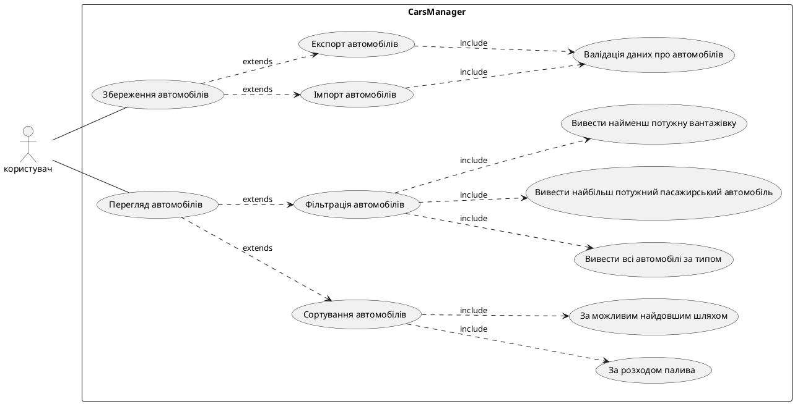

## Use Case Diagram

```plantuml
@startuml
left to right direction
skinparam packageStyle rectangle
actor користувач
rectangle CarsManager {
  користувач -- (Збереження автомобілів)
  (Збереження автомобілів) ..> (Імпорт автомобілів) : extends
  (Збереження автомобілів) ..> (Експорт автомобілів) : extends
  (Імпорт автомобілів) ...> (Валідація даних про автомобілів) : include
  (Експорт автомобілів) ...> (Валідація даних про автомобілів) : include


  користувач -- (Перегляд автомобілів)
  (Перегляд автомобілів) ..> (Сортування автомобілів) : extends
  (Перегляд автомобілів) ..> (Фільтрація автомобілів) : extends

  (Фільтрація автомобілів) ...> (Вивести всі автомобілі за типом) : include
  (Фільтрація автомобілів) ...>  (Вивести найбільш потужний пасажирський автомобіль) : include
  (Фільтрація автомобілів) ...>  (Вивести найменш потужну вантажівку) : include

  (Сортування автомобілів) ...> (За розходом палива) : include
  (Сортування автомобілів) ...> (За можливим найдовшим шляхом) : include
}
@enduml
```
