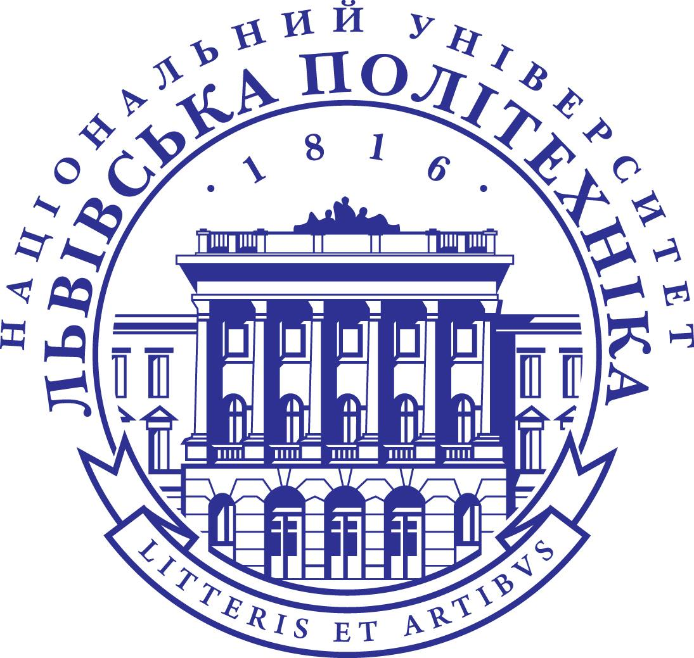
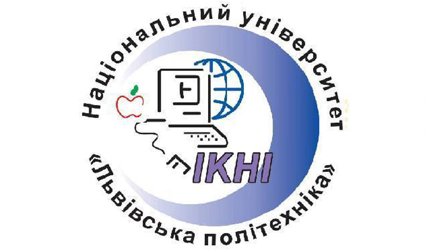

  
  

# Лабки для НУ "Львівська Бебротехніка"

Мої улюблені лабораторні роботи для мого улюбленого університету.

## Зміст

### 2020

- [Основи програмування](2020/basics_of_programming)

### 2021

- [Обʼєктно-орієнтоване програмування](2021/object_oriented_programming)
- [Вступ до інженерії програмного забезпечення](2021/intro_to_software_engineering)
- [Чисельні методи](2021/numerical_analysis)
- [Фізика](2021/physics)

### 2022

- [Операційні системи](2022/operating_systems)
- [Архітектура компʼютера](2022/computer_architecture)
- [Алгоритми і структури даних](2022/algorithms_and_data_structures)
